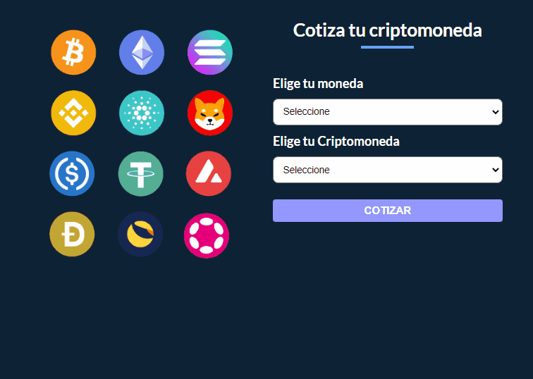

# App Cotización de Criptomonedas

### `Realizado por Néstor Gomez`

Descripción del proyecto:
Aplicación para saber la cotización de una criptomoneda según la moneda elegida,
Pasaje de datos entre componentes mediante props.

- Utilización de los hooks useState y useEffect.
- Creación de Custom Hooks.
- Pasajes de props desde un hijo hacia un padre, enviando una funcion desde el padre para que la ejecute el hijo y retorne el valor al padre.
- Los dos campos del formulario son requeridos
  

Para correr que el proyecto debemos:

- npm run dev

Herramientas utilizadas:

- Vite {React Framework}
- Styled Components (EMOTION)
- API de criptomonedas | https://min-api.cryptocompare.com/documentation
- Spinner "SPINKIT" | https://tobiasahlin.com/spinkit/

